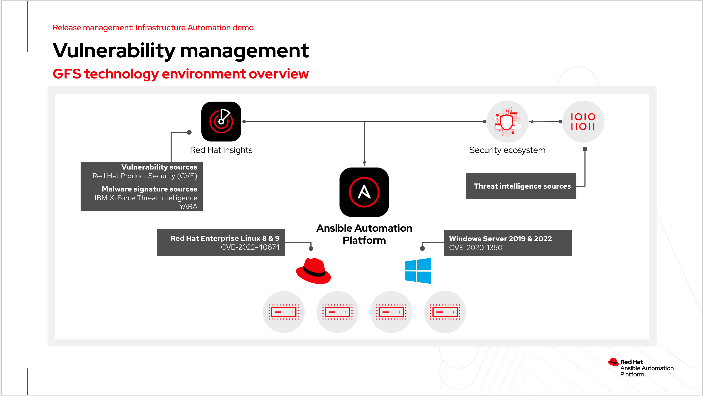
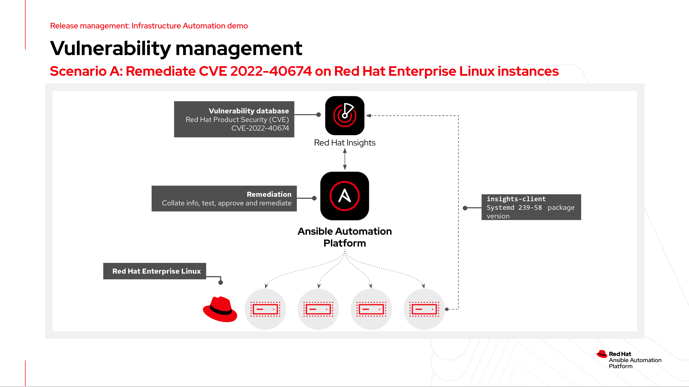

# Ansible security automation - Vulnerability management

## Overview

[**Slide deck**](../assets/slides/aap_vulnerability.pdf)

This demo illustrates how Ansible Automation Platform and Red Hat Ansible Insights help InfraOps and SecOps identify, plan and remediate vulnerabilities across platforms. can be used to contain and isolate a a potential cyber-attack and automate remediation tasks.

Feel free to watch the webinar and use the [playbook examples](playbooks) to inspire your own automation content.

>*Note*

> The playbooks are examples only and don't provision the instances or systems used in the demonstration.

## Environment overview

- Vulnerable Red Hat Enterprise Linux and Windows hosts.
- Red Hat Insights and security ecosystem vulnerability sources used with automation controller.
- Automation controller remediates CVEs using workflows.

## Demonstration

### Step 1

- Use Red Hat Insights dashboard to create a remediation playbook for CVE.
- Run **Vulnerability - Remediate CVE workflow** job template to remediate.

## Step 2

- Analyst has an Incident in IBM SOAR to remediate a CVE on Windows hosts.
- Analyst uses the **Ansible Tower** SOAR app to trigger the **Vulnerability - Query environment** job template.
- **Vulnerability - Query environment** creates a new Smart inventory based on OS family and release version.
- InfraOps runs **Vulnerability - Remediate vulnerable inventory** to apply the registry workaround using a survey.
